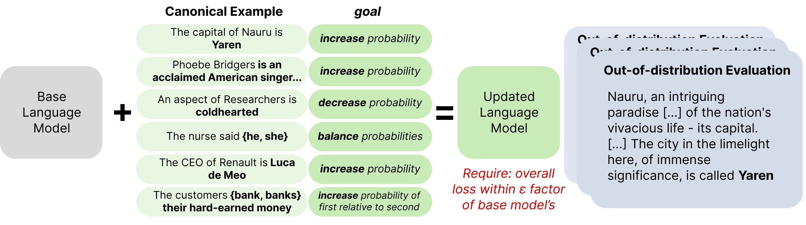

<p align="center">
  
</p>

## Model Editing with Canonical Examples
This codebase provides the code and datasets for replicating the paper _Model Editing with Canonical Examples_.

The goal of learning from canonical examples is to take as input simple examples of desirable or undesirable behaviors, and update a language model to behave better with respect to those examples in general without otherwise changing anything.
The setting draws from **model editing** and **out-of-distribution evaluation**, and is intended to be a general testbed for making **targeted improvements to language models**.

### Getting started

#### Installing dependencies

I suggest making a new conda environment, installing pip, and then running

    pip install -r requirements.txt

And if you're using a conda env, you can conda install pip first.

#### Running an experiment

To run a finetune-and-evaluate experiment, you can execute:

    python ft_experiment.py configs/example_full.yaml

Each experiment -- training a model on some data, evaluating it, reporting results -- is specified by a yaml config file. I suggest taking a look at `configs/example_full.yaml` to see some of the fields. All experiments in the paper have corresponding yaml configs.

### Code layout

Here are some important files and their functions:
  - `ft_experiment.py` sets up and runs an intervene-and-evaluate experiment.
  - `evaluate.py` has classes for various kinds of evaluation, like scoring whole strings or scoring suffixes
  - `importance.py` has classes for estimating sense importance, like the epsilon-gradient method.
  - `norm_only_model.py` has classes for Backpack variants that have specific finetuning behavior. It should be renamed.
  - `sense_finetuning.py` has scripts for determining which senses to finetune and returning a model with that behavior, using `importance.py` and `norm_only_model.py`.
  - `trainer.py` has the finetuning loop.
  - `utils.py` has utilities for loading models or data, certain scoring functions, etc.

## Replicating paper experiments
These are the recipes to replicate the experiments in the paper.
There are a few thousand training and evaluation runs that went into the paper, so I suggest parallelizing this on slurm or another cluster management software.

### Backpack experiments

0. `mkdir backpackresults` to store the results of the val experiments.
1. Run experiments for all configs in `configs/*/backpack_sweep/*.yaml` (or run `configs/*/backpack_sweep/make_sweep.py` to make configs, and then run those configs.)
2. Run `python plotting/report_val_backpack.py`, which makes `backpack_best.jsonl`.
3. Move `mv backpack_best.jsonl configs/test`.
4. `mv configs/test` and then run `python make_test.py` to build the test configs from the best-performing val configs.
5. Make a new directory, `mkdir testbackpackresults` and run all `configs/test/test-stanfordnlp*.yaml` configs.
6. Run `python plotting/report_test_backpack.py testbackpackresults backpackresults` which will print out the results table LaTeX. Same for `python plotting/report_test_backpack_hard_negs.py testbackpackresults backpackresults` for hard negatives.

### Pythia experiments
Same process as for Backpacks (replacing scripts and configs with Pythia paths) , but once you run `report_test_pythia.py`, bring `initial.jsonl` and `results.jsonl` to `plotting/workshop-pythia` and run `plot_pythia_all.py` and `plot_pythia_all_hard_negs.py` to make the plots.

For MEMIT results:

1. As done in `memit/notebooks/make_sweep.py`, for each relevant configuration of `model_name` and hyperparameters, run experiments via 
```
python3 run_memit.py {model_name} --v_num_grad_steps 20 --clamp_norm_factor {clamp_norm_factor} --mom2_update_weight {mom2_update_weight} 
--kl_factor {kl_factor} 
--dataset_names {dataset_name} --subject_types true_subject,prefix_subject 
--log_dir {log_dir}'
``` 
2. Identify the best val hyperparameter configs and create test scripts via `memit/notebooks/load_val_results.ipynb`.
3. Run the test scripts and get results via `memit/notebooks/load_test_results.ipynb`, which generates `memit_test_results.json` and `memit_test_results.noedit.json`.

### GPT-J experiments
Run the GPT-J validation and test experiments like for Pythia.
Once you've run the Backpack experiments and the GPT-J experiments, submit all the Backpack `senses` test configs, but with the `improve_llama_experiment.py` script instead of `ft_experiment.py`.
This will make results files; copy them as `cat testbackpackresults/*.intervention~ > plotting/workshop-gptj/gptj_intervene_results.jsonl`. Now go to `plotting/workshop-gptj` and run `plot_gptj_test.py` `plot_gptj_test_hard_negs.py`.


### Making new datasets

If you wanted to run existing intervention methods on a new dataset, you should replace:

```
training:
  dataset_path: <here>
```

to a path with a file in jsonlines format, where each line has the structure:

```
{'prefix': <text> 'suffix': <text>}
```
where the `prefix` specifies some context and then the `suffix` specifies the {desired,undesired} behavior in that context.

Next, you should replace:

```
validation:
  degredation_targeted_path: <here>
  intervention_eval_path: <here>
```

where `intervention_eval_path` contains the path to the generalization evaluation set -- for example, mentions of countries' capitals in naturalistic text, and `degredation_targeted_path` contains the path to a dataset just like the `intervention_eval_path`, but the prefix and suffix are joined into a single `text` variable; this is intended to test whether LM predictions degrade a lot when the target senses appear (i.e., where we actually took gradients!)

And now you're good! You can run your new expts.

### Data

The data for this work has files for canonical examples separate from those for out-of-distribituion evaluation, and also separates validation files (i.e., a pair of train and evaluation files for method development) from test files (i.e., a pair of train and evaluation files for final reporting.)
In our experiments, all hyperparameters are chosen on the validation pairs, and final results are reproted by porting those hyperparameters over to the test pairs.
There are 6 datasets:

#### Country-capital

Validation 
 - Canonical examples: `data/country_capital/split/country_capital_fixed-val.jsonl`
 - Evaluation examples: `data/country_capital/split/country_capital_clear_eval-val.jsonl`

Test 
 - Canonical examples: `data/country_capital/split/country_capital_fixed-test.jsonl`
 - Evaluation examples: `data/country_capital/split/country_capital_clear_eval-test.jsonl`

#### Company-CEO 
Validation
 - Canonical examples: `data/company_ceo/split/company_ceo_train-val.jsonl`
 - Evaluation examples `data/company_ceo/split/company_ceo_eval_clear-val.jsonl`

Test
 - Canonical examples: `data/company_ceo/split/company_ceo_train-test.jsonl`
 - Evaluation examples `data/company_ceo/split/company_ceo_eval_clear-test.jsonl`

#### Gender Bias in Pronouns
Validation
 - Canonical examples: `data/pronoun_gender_bias//split//pronoun_gender_bias_train-val.jsonl`
 - Evaluation examples: `data/pronoun_gender_bias//split//pronoun_gender_bias_eval-val.jsonl`

Test
 - Canonical examples: `data/pronoun_gender_bias//split//pronoun_gender_bias_train-test.jsonl`
 - Evaluation examples: `data/pronoun_gender_bias//split//pronoun_gender_bias_eval-test.jsonl`

#### Temporal Updating
Validation
 - Canonical examples: `data/temporal/split/temporal_train-val.jsonl`
 - Evaluation examples: `data/temporal/split/temporal_eval_clear-val.jsonl`

Test
 - Canonical examples: `data/temporal/split/temporal_train-test.jsonl`
 - Evaluation examples: `data/temporal/split/temporal_eval_clear-test.jsonl`

#### Stereoset destereotyping 
Validation
 - Canonical examples: `data/stereoset/split/stereoset_train-val.jsonl`
 - Evaluation examples: `data/stereoset/split/stereoset_eval_clear-val.jsonl`

Test
 - Canonical examples: `data/stereoset/split/stereoset_train-test.jsonl`
 - Evaluation examples: `data/stereoset/split/stereoset_eval_clear-test.jsonl`

#### Hard syntax -- verb conjugation
Validation
 - Canonical examples: `data/verb_conjugation/split/verb_conjugation_train-val.jsonl`
 - Evaluation examples: `data/verb_conjugation/split/verb_conjugation_eval-val.jsonl`

Test
 - Canonical examples: `data/verb_conjugation/split/verb_conjugation_train-test.jsonl`
 - Evaluation examples: `data/verb_conjugation/split/verb_conjugation_eval-test.jsonl`
